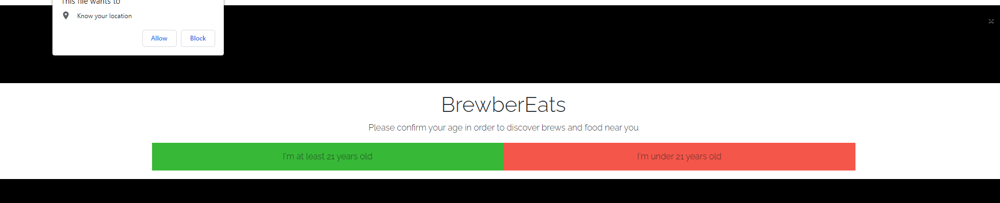
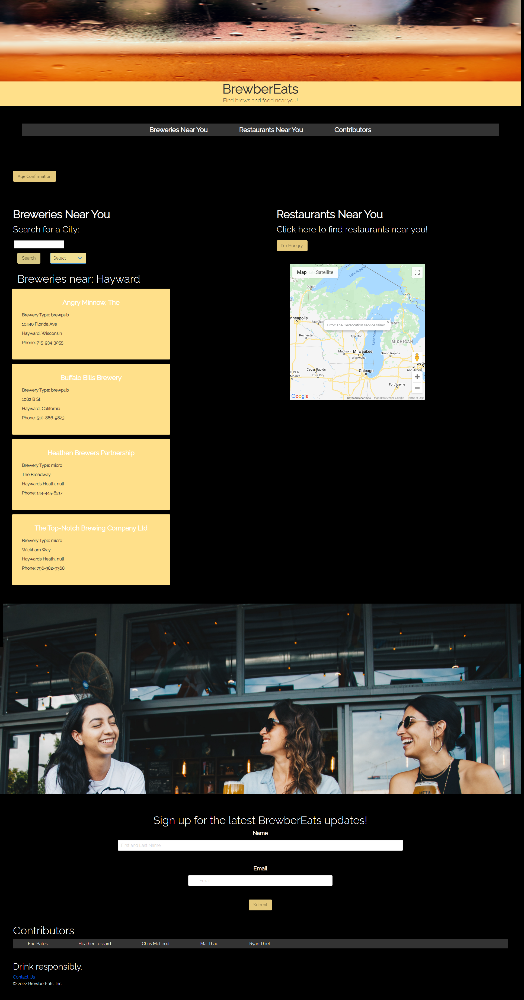
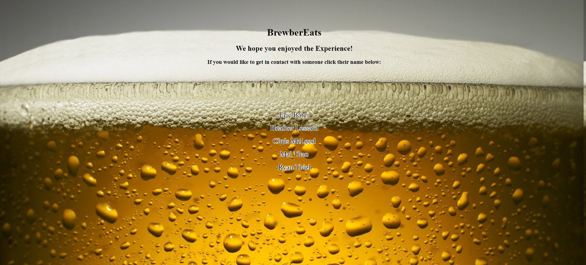

# BrewberEats 

## Table of Contents
--------------------

[Introduction](#Introduction)  
[Live Link & Screenshots](#Live-Link-&-Screenshots)  
[Technologies Used](#Technologies-Used)  
[Contact Info](#Contact-Info)  
[Maintainers](#Maintainers)  

## Introduction
---------------

BrewberEats is great for anyone who is looking to search for, and try new breweries by location.  If they get hungry, they can also view where restaurants are in their local area.

## User Instructions
--------------------
1. Click on pop up window to allow website to use your location
2. Confirm whether you are at least age 21 or not
3. Type a city in the "Search for City" text box and hit "Search" button
4. Breweries with their individual info will display on screen
5. Click "I'm Hungry" button and a map will appear with pins of restaurants in your area.

## Live Link & Screenshots
--------------------------

**View the application here:** [BrewberEats](https://hmlessard.github.io/Brewber/ "BrewberEats")

**View website screenshots here:**

## Technologies Used
--------------------

* HTML
* CSS
* JavaScript
* Web APIs
    
    * [OpenBreweryDB](https://api.openbrewerydb.org "OpenBreweryDB")
    * [Pexels](https://www.pexels.com/api/ "Pexels")
    * [GooglePlacesAPI](https://developers.google.com/maps/documentation/places/web-service/search "GooglePlaces")
* Local Storage
* CSS Framework
    * [Bulma](https://bulma.io/)

## Maintainers
---------------

* [Eric Bates](https://github.com/ericbwebdev86)
* [Heather Lessard](https://github.com/Hmlessard/)
* [Chris McLeod](https://github.com/Chris-McLeod2)
* [Mai Thao](https://github.com/mthao14)
* [Ryan Thiel](https://github.com/rtthiel8)

## License
MIT license is a short and simple permissive license with conditions only requiring preservation of copyright and license notices. Licensed works, modifications, and larger works may be distributed under different terms and without source code.
